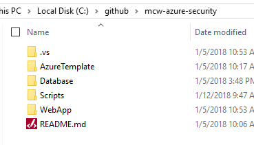
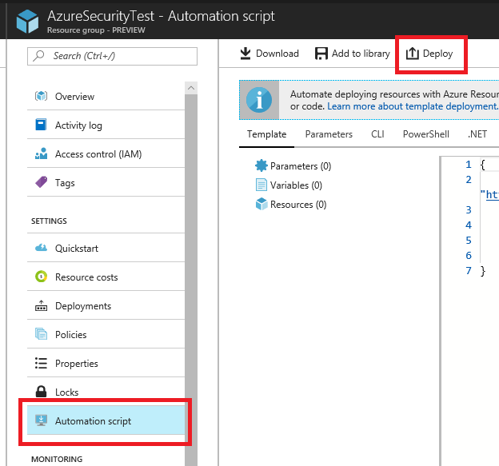
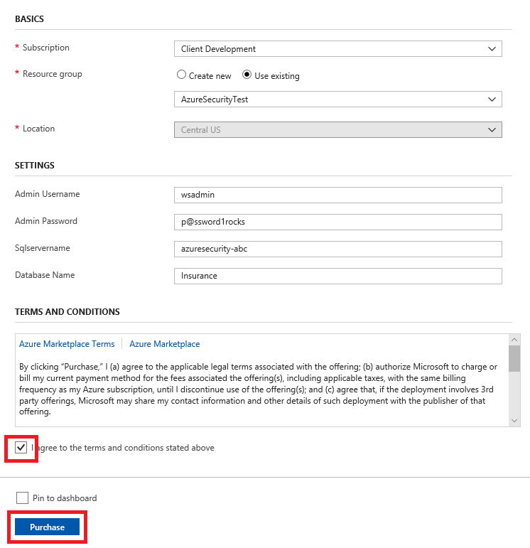
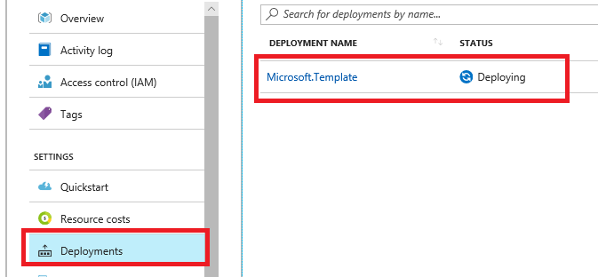
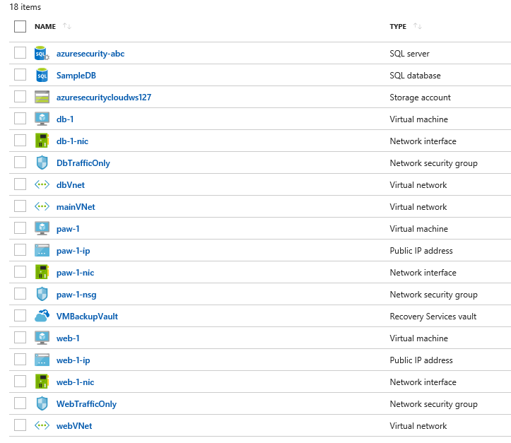

Azure security, privacy and compliance

Before the hands-on lab setup guide

May 2018

## Before the hands-on lab

Duration: 30 minutes

Synopsis: In this exercise, you will set up your environment for use in the rest of the hands-on lab. You should follow all the steps provided in the Before the Hands-on Lab section to prepare your environment *before* attending the workshop.

### Task 1: Download GitHub resources

1.  Open a browser window to the cloud workshop GitHub repository (<https://github.com/Microsoft/MCW-Azure-Security-Privacy-and-Compliance>)

2.  Select **Clone or download**, then select **Download Zip**

    

3.  Extract the zip file to your local machine, be sure to keep note of where you have extracted the files, you should

    now see a set of folders:

    

### Task 2: Deploy resources (virtual machine, etc.) to Azure

1.  Open your Azure Portal

2.  Select **Resource groups**

3.  Select **+Add**

4.  Type a resource group name, such as **azsecurity-\[your initials or first name\]**

5.  Select **Create**

6.  Select **Refresh** to see your new resource group displayed and select it

7.  Select **Automation Script**, and then select **Deploy**

    

8.  Select **Build your own template in the editor**

9.  In the extracted folder, open the **\\Scripts\\template.json**

10. Copy and paste it into the window

11. Select **Save**, you will see the dialog with the input parameters. Fill out the form:

    a.  Subscription: select your **subscription**

    b.  Resource group: Use an existing Resource group, or create a new one by entering a unique name, such as **azsecurity-\[your initials or first name\]**

    c.  Location: Select a **location** for the Resource group. Recommend using East US, East US 2, West Central US, or West US 2.

    d.  Modify the **sqlservername** to be something unique such as "azsecurity-\[your initials or first name\]"

    e.  Fill in the remaining parameters, but if you change anything, be sure to note it for future reference throughout the lab

    f.  Check the **I agree to the terms and conditions stated above** checkbox

    g.  Select **Purchase**

        

12. The deployment will take about 15 minutes to complete. To view the progress, select the **Deployments** link.

    

    h.  As part of the deployment, you will see the following items created:

        -   One storage account

        -   Three virtual networks

        -   Three network security groups

        -   Three virtual machines (db-1, web-1, paw-1)

            -   IIS is installed on web-1 via a DSC script from the GitHub repository

        -   One SQL Azure Server

        -   One Recovery Services vault

            

13. See Appendix A for detailed steps on creating these components without using an ARM template

You should follow all steps provided *before* attending the hands-on lab
